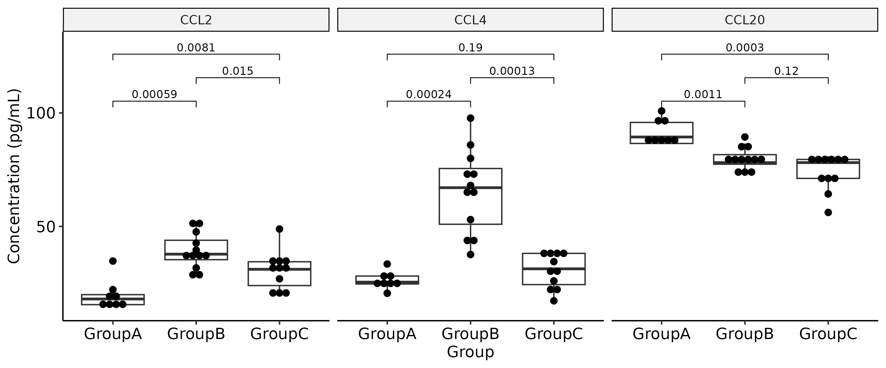

# ELISA analysis

Here we discuss the processing of ELISA results using 4 parameter logistic (4-PL) regression.

- [ELISA analysis](#elisa-analysis)
  - [Import data](#import-data)
    - [Run 4-PL regression](#run-4-pl-regression)
    - [Plot data](#plot-data)
      - [Plot each plate individually](#plot-each-plate-individually)
      - [Combine data and plot](#combine-data-and-plot)


## Import data

Firstly we need to load the relevant packages, including `dr4pl` which will handle the 4-PL regression step.

```r
# Choose packages to load
pkgs <- c('here', 'tidyverse', 'dplyr', 'readr', 'ggplot2', 'ggpubr', 'ggsci', 'doParallel', 'dr4pl')

# Load packages
pacman::p_load(char = pkgs)
```

We can then read in the results of the ELISA plates into a list. Here is it assumed that you have collected your data into a "long" format (see example below), and that you have a group called `Standard` that collect your calibrators together.

```bash
sample_id,group,od_450,od_540
A1,control,0.324,0.054
A2,control,0.287,0.057
B1,treatment,0.156,0.054
B2,treatment,0.167,0.056
... # Additional samples
2000,Standard,1.254,0.055
1000,Standard,0.695,0.057
500,Standard,0.415,0.056
... # Additional standards
0,Standard,0.074,0.057 # Blanks (include in "Standard" group)
```

Assuming you have all your plates collected as individual `.csv` files within their own folder, you can read in the results as follows.

```r
# Read ELISA results in to a list
files <- list.files(here('input'))
plates <- gsub('.csv', '', files)
elisa_list <- foreach(i = files) %do% {
    read_csv(here('input', i), col_types = 'ffnn')
}; names(elisa_list) <- plates
```

This will result in a list containing each of the plates, with their names (derived from the file name) used to denote each one.

### Run 4-PL regression

Using the `dr4pl` package, we can loop through the plates and convert the OD540-corrected OD450 absorbance values into their appropriate concentration.

In this case, samples with technical repeats will have their corrected OD450 values averaged (mean) prior to concentration calculation. Alter the final step if you do not want this to happen.

```r
# Loop through each plate and calculate concentration using 4-PL regression
fit4PL <- foreach(i = plates) %do% {
    # Retrieve the corresponding data from the 'elisa_list' using the current file name and correct OD450
    data <- elisa_list[[i]] %>%
        mutate(od_final = od_450 - od_540)
    
    # Filter the data to include only 'Standard' group and calculate the mean for numeric columns
    curve <- data %>%
        filter(group == 'Standard') %>%
        group_by(sample) %>%
        summarise(across(where(is.numeric), mean)) %>%
        dplyr::select(sample, od_final)
    
    # Convert 'sample' column to numeric to be used as dose
    dose <- as.numeric(as.character(curve$sample))
    
    # Extract the 'od_final' column as the response variable
    response <- curve$od_final
    
    # Filter out the 'Standard' group from the original data
    data <- data %>% filter(!group == 'Standard')
    
    # Fit the dose-response curve using the dr4pl package with logistic model and Tukey's robust method
    fit <- dr4pl(response ~ dose, method.init = 'logistic', method.robust = 'Tukey')
    
    # Extract the fitted parameters from the model
    fit_params <- fit$parameters
    
    # Group by 'group' and 'sample', calculate the mean for numeric columns, and estimate concentrations
    data <- data %>%
        group_by(group, sample) %>%
        summarise(across(where(is.numeric), mean)) %>%
        mutate(pgmL = conc(od_final, fit_params)) # rename if not pg/mL

    # Return just the data element with calculated concentrations
    return(data)
}; names(fit4PL) <- plates
```

### Plot data

From here, you could choose to run statistical tests or plot each plate individually, or combine the data together for further analysis.

#### Plot each plate individually

In this case, each plate represents a different target protein and data should therefore be plotted individually.

```r
# Loop through the plates and generate a plot for each
elisa_plots <- foreach(i = plates) %do% {
    # Retrieve the corresponding data from the 'elisa_list' using the current file name and correct OD450
    data = fit4PL[[i]]

    # Generate a ggplot2 plot using the data
    p <- ggplot(data, aes(x = group, y = pgmL)) +
        geom_boxpot(aes(fill = group)) +
        stat_compare_means(comparisons = list(c(1,2)), size = 3) +
        geom_dotplot(binaxis = 'y', stackdir = 'center') +
        theme_pubr(base_size = 8, legend = 'right') +
        labs(title = str_to_upper(i),
             x = 'Group',
             y = 'Concentration (pg/mL)')
}

# Combine the plots into a single plot using ggarrange
p_arr <- ggarrange(plotlist = elisa_plots, nrow = 1)

# Save the plots as both PDF and PNG files
foreach(i = c('pdf', 'png')) %do% {
    ggsave(here('figures', paste0('elisa_plots.', i)),
           p_arr, width = 18, height = 18, units = 'cm')
}
```
<div style='text-align: center;'>
    
</div>

#### Combine data and plot

Similarly, we could combine all the data and then facet by plate (or not at all). Combining different plates and plotting together should be treated with caution however &ndash; due to variation between plates, you may consider normalising to percentage or fold-change vs. a control group.

```r
# Combine the data, making sure to create a new column to reference the plate
fit4PL_combined <- foreach(i = plates, .combine = 'rbind') %do% {
    fit4PL[[i]] %>%
        mutate(plate = str_to_upper(i))
}

# Generate a plot for all data and facet by plate
p <- ggplot(fit4PL_combined, aes(x = group, y = pgmL)) +
    geom_boxplot(aes(fill = group)) +
    stat_compare_means(comparisons = list(c(1,2)), size = 3) +
    geom_dotplot(binaxis = 'y', stackdir = 'center') +
    theme_pubr(base_size = 8, legend = 'right') +
    labs(x = 'Group',
         y = 'Concentration (pg/mL)') +
    facet_grid(cols = vars(plate)) +
    coord_cartesian(ylim = c(NA, 130)) # Adjust to avoid p-value cut-off

# Save the plot in both PDF and PNG format
foreach(i = c('pdf', 'png')) %do% {
    ggsave(here('figures', paste0('elisa_plot_facetted.', i)),
           p, width = 18, height = 18, units = 'cm')
}
```

<div style='text-align: center;'>
    
</div>